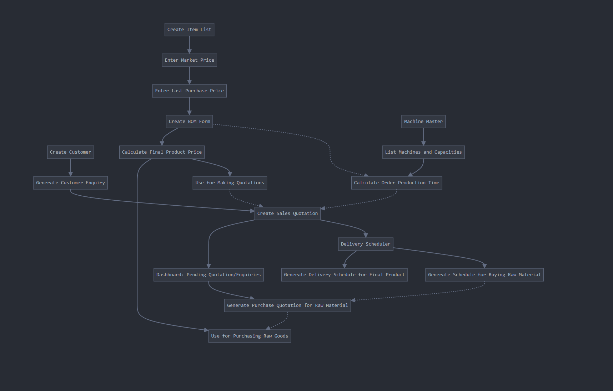
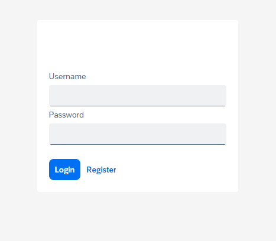
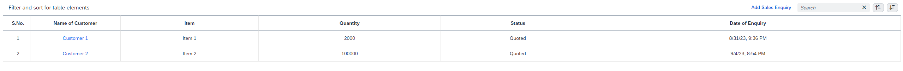
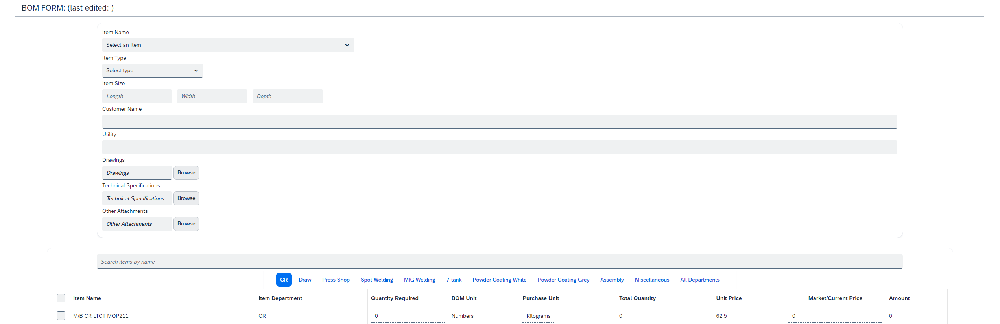
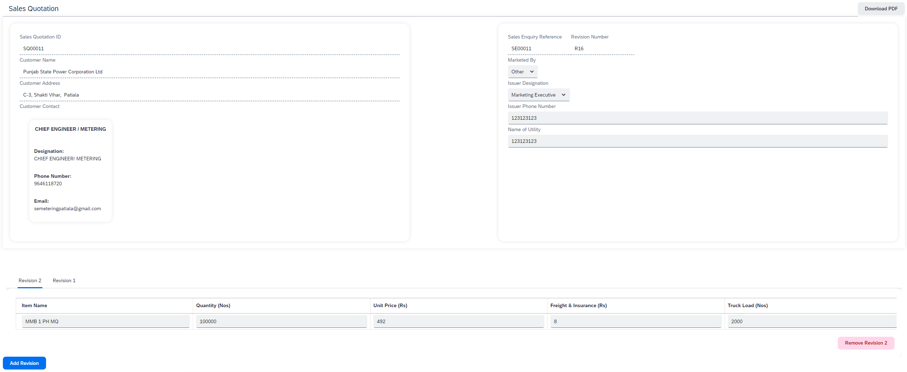
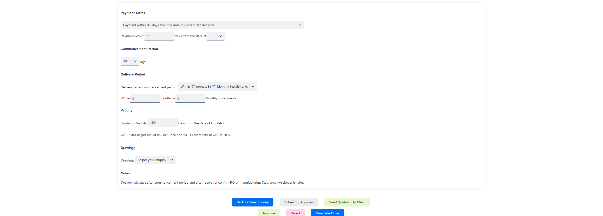

# ERP Software Showcase

**Author:** Saurab Dhir  
**Contact:** [sda105@sfu.ca](mailto:sda105@sfu.ca)

## 📽️ Project Overview Video

---

## 📖 Table of Contents

- [📽️ Project Overview Video](#-project-overview-video) (To be posted!)
- [🔃 Work Flow ](#-work-flow)
- [🔑 Key Features](#-key-features)
- [📊 Technical Stack](#technical-stack)
- [📞 Contact Information](#disclaimer)

---

## 🔃 Work Flow 

## 🔑 Key Features

### 1. 🔐 User Authentication & Authorization

### 2. 👥 Customer Information Management

### 3. 📃 Bill of Materials Generation

### 4. 💼 Sales Quotation Generation

---

## 📊 Technical Stack
- **Frontend:** Angular 
- **Backend:** Node.js 
- **Database:** MySQL 

---

## 📞 Contact Information

For inquiries or demonstrations, please contact me via email (sda105@sfu.ca).

---

